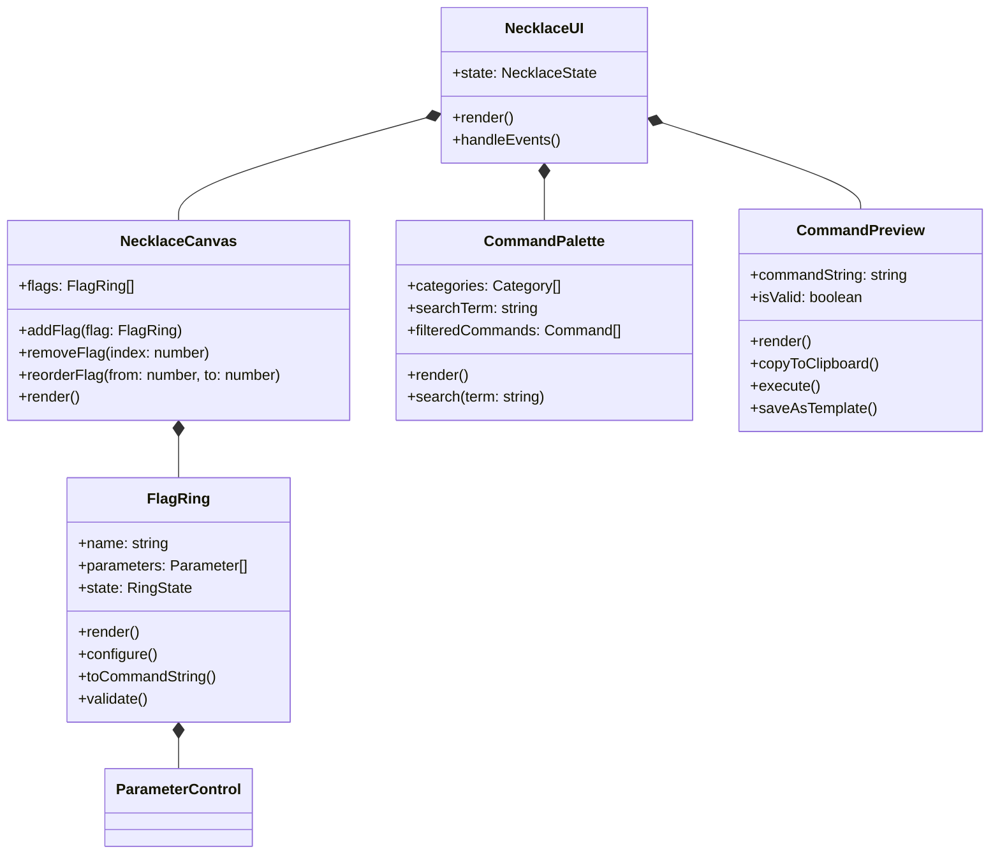

# Necklace of Flags: Interactive UI Concept for LLT

## 1. Introduction

The Necklace of Flags is a visual command composition interface for the Little Language Terminal (LLT). It transforms abstract CLI commands into tangible visual objects arranged in a sequence, making powerful command chains more intuitive and accessible.

This UI concept preserves the functional essence of LLT's command pipeline while introducing visual metaphors that make complex operations more discoverable and comprehensible.

## 2. Design Philosophy

The Necklace Canvas embodies several key principles:

1. **Command Physicality** - Abstract CLI flags become tangible objects users can manipulate
2. **Visual Composition** - Pipeline creation through spatial arrangement rather than text typing
3. **Progressive Disclosure** - Simple interface with depth available on demand
4. **Functional Transparency** - Clear mapping between visual elements and CLI commands
5. **Real-time Feedback** - Command preview updates instantly as users compose

## 3. Visual Structure and Components

### 3.1. The Necklace Canvas

```
┌──────────────────────────────────────────────────────────────────────────────┐
│ COMMAND COMPOSITION AREA                                                     │
│                                                                              │
│   ┌───────┐      ┌───────┐      ┌───────┐      ┌───────┐      ┌───────┐     │
│   │  llt  │──────│ load  │──────│ xml   │──────│prompt │──────│complet│     │
│   └───────┘      └───────┘      └───────┘      └───────┘      └───────┘     │
│                     ▼              ▼              ▼                          │
│                  ┌─────┐        ┌─────┐        ┌─────┐                      │
│                  │file │        │value│        │value│                      │
│                  └─────┘        └─────┘        └─────┘                      │
│                                                                              │
└──────────────────────────────────────────────────────────────────────────────┘
```

The canvas provides a spatial representation of command order, with:

- **Flow Direction** - Left-to-right to match reading direction
- **Connection Lines** - Visual reinforcement of command sequence
- **Parameter Expansion** - Dropdown display of parameter values
- **Ring Sizing** - Different sizes based on importance/complexity
- **Color Coding** - Visual categorization of command types

### 3.2. Flag Rings: Command Visualizations

Each ring represents a flag with appropriate UI controls:

```
┌─────────────────────────────────────────────┐
│         ANATOMY OF A FLAG RING              │
│                                             │
│         ┌─────────────────────┐             │
│         │       --prompt      │  Flag name  │
│         └─────────────────────┘             │
│                                             │
│         ┌─────────────────────┐             │
│ Value:  │"Update config file" │  Parameter  │
│         └─────────────────────┘             │
│                                             │
│         [⚙️ Configure] [❌ Remove]           │
│                                             │
└─────────────────────────────────────────────┘
```

Rings have distinct states:

- **Default** - Normal appearance when part of command chain
- **Selected** - Highlighted when being configured
- **Dragging** - Semi-transparent during positioning
- **Error** - Red highlight for validation issues
- **Disabled** - Grayed out for incompatible combinations

### 3.3. The Command Palette

```
┌─────────────────────────────────────────────────────────────────────┐
│ COMMAND PALETTE           🔍 [Search commands...]                   │
│                                                                     │
│ [Conversation] [Files] [LLM] [Git] [Display] [Utilities] [All]      │
│                                                                     │
│ ┌─────────┐ ┌─────────┐ ┌─────────┐ ┌─────────┐ ┌─────────┐        │
│ │  save   │ │  load   │ │ prompt  │ │  fold   │ │  view   │        │
│ └─────────┘ └─────────┘ └─────────┘ └─────────┘ └─────────┘        │
│                                                                     │
│ RECENTLY USED                                                       │
│ ┌─────────┐ ┌─────────┐ ┌─────────┐ ┌─────────┐                    │
│ │ complete│ │  xml    │ │ execute │ │git_diff │                    │
│ └─────────┘ └─────────┘ └─────────┘ └─────────┘                    │
│                                                                     │
└─────────────────────────────────────────────────────────────────────┘
```

The palette serves as the source of available commands:

- **Categorized Tabs** - Group related commands
- **Search** - Quick filtering by name or description
- **Recently Used** - Quick access to common operations
- **Visual Hints** - Icon indicators for command types
- **Tooltips** - Brief descriptions on hover

### 3.4. Command Preview

```
┌─────────────────────────────────────────────────────────────────────────┐
│ COMMAND PREVIEW                                                         │
│                                                                         │
│ llt --load config.ll --xml config --prompt "Update config" --complete   │
│                                                                         │
│ [COPY] [EXECUTE] [SAVE AS TEMPLATE]                                     │
└─────────────────────────────────────────────────────────────────────────┘
```

The preview provides real-time feedback on the composed command:

- **Syntax Highlighting** - Color coding for flag types
- **Error Indication** - Highlighting of problematic sections
- **Action Buttons** - Direct execution without leaving the UI
- **Clipboard Integration** - Easy transfer to terminal or scripts

## 4. Interaction Patterns

### 4.1. Basic Command Construction

1. **Starting a Command**
   - Begin with the fixed "llt" ring as the command anchor
   - Command palette shows suggested starting commands

2. **Adding Commands**
   - Drag a ring from the palette to the necklace
   - Drop zones highlight as valid positions
   - Ring snaps into place with connecting lines formed
   - Command preview updates to show CLI command

3. **Setting Parameters**
   - Click a ring to configure its parameters
   - Simple parameters editable directly on the ring
   - Complex parameters open a dedicated modal
   - Real-time validation with visual feedback

4. **Reordering Operations**
   - Drag rings to new positions along the necklace
   - Command sequence updates dynamically
   - Preview refreshes with new command order
   - Incompatible positions are visually blocked

### 4.2. Working with Templates

```
┌─────────────────────────────────────────────────────────────────┐
│ COMMAND TEMPLATES                                               │
│                                                                 │
│ ► File Analysis                                                │
│   Analyze a file and provide suggestions                       │
│   llt --file [path] --prompt [text] --complete                 │
│                                                                 │
│ ► Project Overview                                             │
│   Generate documentation for project structure                 │
│   llt --include_project_context --prompt [text] --complete     │
│                                                                 │
│ ► Git Change Review                                            │
│   Review and explain recent changes                            │
│   llt --git_diff --prompt "Explain these changes" --complete   │
│                                                                 │
│ [New Template] [Import] [Export]                               │
└─────────────────────────────────────────────────────────────────┘
```

Templates enable saving and reusing common workflows:

1. **Creating Templates**
   - Compose a command chain
   - Click "Save as Template"
   - Name and describe the template
   - Mark parameters as variables with placeholders

2. **Using Templates**
   - Select a template from the library
   - Placeholders highlighted for replacement
   - Fill in required values
   - Execute directly or customize further

3. **Template Library**
   - Categorized templates for different tasks
   - Import/export for sharing with team
   - Version tracking for template evolution

### 4.3. Parameter Configuration Modal

```
┌───────────────────────────────────────────────────────────┐
│ CONFIGURE: execute                                        │
├───────────────────────────────────────────────────────────┤
│                                                           │
│ Language:                                                 │
│ ┌────────────────────────────────────┐                    │
│ │ python                           ▼ │                    │
│ └────────────────────────────────────┘                    │
│                                                           │
│ Timeout:                                                  │
│ ┌───────────┐  seconds                                    │
│ │    30     │                                             │
│ └───────────┘                                             │
│                                                           │
│ Content:                                                  │
│ ┌────────────────────────────────────┐                    │
│ │ import os                          │                    │
│ │ print("Hello, world!")             │                    │
│ └────────────────────────────────────┘                    │
│                                                           │
│ ▶ Advanced Options                                        │
│                                                           │
│           [Cancel]    [Apply]                             │
└───────────────────────────────────────────────────────────┘
```

Parameter configuration follows these principles:

- **Type-appropriate Controls** - Suited to the parameter type (dropdown, text, toggle)
- **Validation** - Real-time feedback on parameter validity
- **Progressive Disclosure** - Advanced options hidden by default
- **Context Help** - Tooltips explaining parameter purpose
- **Default Values** - Pre-filled with sensible defaults

## 5. Visual Command Workflows

### 5.1. Content Processing Workflow

This visual workflow represents processing a file with LLM assistance:

```
┌─────────┐    ┌─────────┐    ┌─────────┐    ┌─────────┐    ┌─────────┐
│   llt   │────│  file   │────│  xml    │────│ prompt  │────│complete │
└─────────┘    └─────────┘    └─────────┘    └─────────┘    └─────────┘
                    │              │              │
                    ▼              ▼              ▼
                ┌─────────┐    ┌─────────┐    ┌─────────┐
                │config.py│    │  code   │    │"Refactor│
                └─────────┘    └─────────┘    │this code"│
                                              └─────────┘
```

CLI equivalent:
```bash
llt --file config.py --xml code --prompt "Refactor this code" --complete
```

### 5.2. Project Documentation Workflow

This workflow demonstrates generating project documentation:

```
┌─────────┐    ┌─────────┐    ┌─────────┐    ┌─────────┐    ┌─────────┐
│   llt   │────│include_ │────│  fold   │────│ prompt  │────│complete │
└─────────┘    │project_ │    └─────────┘    └─────────┘    └─────────┘
                │context │                        │              │
                └─────────┘                       ▼              ▼
                    │                       ┌─────────┐     ┌─────────┐
                    ▼                       │"Document│     │   save  │
                ┌─────────┐                 │structure"│    └─────────┘
                │glob=*.py│                 └─────────┘         │
                └─────────┘                                     ▼
                                                          ┌─────────┐
                                                          │docs.ll  │
                                                          └─────────┘
```

CLI equivalent:
```bash
llt --include_project_context glob="*.py" --fold --prompt "Document structure" --complete --save docs.ll
```

## 6. Implementation Architecture

### 6.1. Component Structure



### 6.2. Core TypeScript Interfaces

```typescript
interface NecklaceState {
  flags: CommandFlag[];
  selectedIndex: number | null;
  dragSource: number | null;
  dragTarget: number | null;
  validationErrors: ValidationError[];
  
  // Actions
  addFlag(flag: CommandFlag): void;
  removeFlag(index: number): void;
  moveFlag(fromIndex: number, toIndex: number): void;
  updateParameter(flagIndex: number, paramName: string, value: any): void;
  validateAll(): boolean;
  generateCommandString(): string;
}

interface CommandFlag {
  id: string;
  name: string;
  category: string;
  description: string;
  parameters: Parameter[];
  
  isValid(): boolean;
  toCommandString(): string;
}

interface Parameter {
  name: string;
  type: 'string' | 'number' | 'boolean' | 'select';
  value: any;
  options?: string[]; // For select type
  required: boolean;
  description?: string;
  validate(): ValidationResult;
  toCommandString(): string;
}
```

### 6.3. Event Flow and State Management

The UI uses unidirectional data flow:

1. User interaction triggers an event handler
2. Handler dispatches an action to update state
3. State changes trigger re-render of affected components
4. UI reflects the new state
5. Command preview updates based on new state

## 7. Accessibility Features

The interface prioritizes accessibility:

- **Keyboard Navigation** - Complete operation without mouse
- **Screen Reader Support** - ARIA labels and semantic structure
- **Focus Management** - Clear visual indicators of focus state
- **Color Contrast** - WCAG AA compliance
- **Reduced Motion** - Options for users with motion sensitivity
- **Text Scaling** - Support for browser text size adjustments

## 8. Animation and Transitions

Thoughtful animations enhance understanding:

- **Ring Insertion** - Rings slide apart to make room
- **Connection Drawing** - Lines animate between connected rings
- **Parameter Expansion** - Smooth expansion when revealing parameters
- **Drag Feedback** - Visual cues during drag operations
- **Error Indication** - Subtle pulsing for validation issues

## 9. Command History and Sessions

```
┌────────────────────────────────────────────────────────────┐
│ COMMAND HISTORY                                            │
│                                                            │
│ ● Today 12:30 PM                                           │
│   llt --load project.ll --prompt "Refactor API" --complete │
│                                                            │
│ ● Today 11:15 AM                                           │
│   llt --git_diff --xml changes --complete                  │
│                                                            │
│ ● Yesterday 4:45 PM                                        │
│   llt --include_project_context --save context.ll          │
│                                                            │
│ ● 2 days ago                                               │
│   llt --execute --language python --timeout 60             │
│                                                            │
└────────────────────────────────────────────────────────────┘
```

The system maintains command history:

- **Session Tracking** - Record all commands in a session
- **Command Replay** - Re-run previous commands
- **Favorites** - Star frequently used commands
- **Export** - Save command history as shell script
- **Analytics** - Visualize command usage patterns

## 10. Implementation Technologies

### 10.1. Frontend Stack

- **React/Vue.js** - Component-based architecture
- **TypeScript** - Type safety for complex state management
- **SVG/Canvas** - Vector graphics for the necklace visualization
- **TailwindCSS** - Utility-first styling system
- **React DnD** - Drag and drop functionality

### 10.2. Persistence

- **LocalStorage** - Command history and user preferences
- **IndexedDB** - Template library and session data
- **File Export/Import** - JSON template sharing

## 11. Future Extensions

### 11.1. Advanced Visual Workflows

```
┌─────────────────────────────────────────────────────────┐
│ WORKFLOW EDITOR                                         │
│                                                         │
│  ┌───────┐      ┌───────┐                               │
│  │  llt  │──────│ git   │─┐                             │
│  └───────┘      └───────┘ │                             │
│                           ▼                             │
│                      ┌─────────┐     ┌───────┐     ┌───────┐    │
│                      │ if_diff │─────│prompt │─────│complet│    │
│                      └─────────┘     └───────┘     └───────┘    │
│                           │                                      │
│                           ▼                                      │
│                      ┌─────────┐     ┌───────┐                  │
│                      │  else   │─────│  view │                  │
│                      └─────────┘     └───────┘                  │
│                                                                 │
└─────────────────────────────────────────────────────────────────┘
```

Future extensions could include:

- **Conditional Branches** - If/else logic for command paths
- **Loops** - Repeated operations with different inputs
- **Subgraphs** - Encapsulate complex operations as single components
- **Parallel Execution** - Multiple command paths running simultaneously
- **Visual Debugging** - Watch data flow through the command pipeline

### 11.2. Collaboration Features

- **Shared Templates** - Team template library
- **Live Collaboration** - Multiple users editing the same command
- **Version Control** - Track template changes over time
- **Role-based Access** - Control who can view and edit commands
- **Comments** - Add notes to specific rings or commands

## 12. Implementation Roadmap

A phased approach to developing the Necklace Canvas UI:

### Phase 1: Core Functionality (4-6 weeks)
- Basic necklace visualization with drag and drop
- Simple parameter configuration
- Command preview generation
- Command palette with basic categorization

### Phase 2: Enhanced User Experience (4-6 weeks)
- Advanced parameter configuration
- Command templates
- Command history
- Improved visual design and animations

### Phase 3: Collaboration & Extensions (8-10 weeks)
- Template library with sharing
- Command history analysis
- Visual workflow editor
- Mobile responsive design

## 13. Conclusion

The Necklace of Flags UI transforms LLT from a powerful but text-based tool into an intuitive visual programming environment. By representing commands as tangible objects on a canvas, it makes command composition more accessible while preserving the functional essence of LLT's architecture.

This interface bridges the gap between CLI power and visual intuitiveness, enabling both newcomers and power users to build complex command chains with confidence. The visual representation serves both as an interface and as documentation, showing the relationship between operations in a clear, visual manner.
